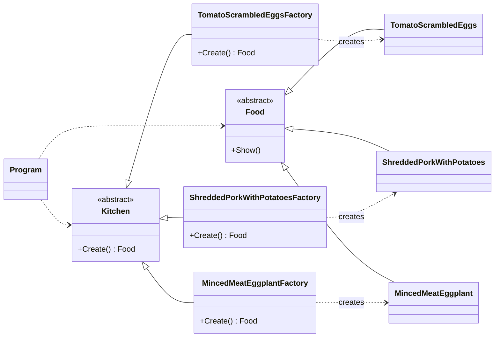

# 工厂模式

工厂方法模式通过面向对象编程中的多态性来将对象的创建延迟到具体工厂中，从而解决了简单工厂模式中存在的问题，也很好地符合了开放——封闭原则（即对扩展开放，对修改封闭）。

```mermaid
classDiagram
    direction LR

    class Food {
        <<abstract>>
        +Show()
    }

    class TomatoScrambledEggs
    class ShreddedPorkWithPotatoes
    class MincedMeatEggplant

    class Kitchen {
        <<abstract>>
        +Create() Food
    }

    class TomatoScrambledEggsFactory {
        +Create() Food
    }

    class ShreddedPorkWithPotatoesFactory {
        +Create() Food
    }

    class MincedMeatEggplantFactory {
        +Create() Food
    }

    class Program

    Food <|-- TomatoScrambledEggs
    Food <|-- ShreddedPorkWithPotatoes
    Food <|-- MincedMeatEggplant

    Kitchen <|-- TomatoScrambledEggsFactory
    Kitchen <|-- ShreddedPorkWithPotatoesFactory
    Kitchen <|-- MincedMeatEggplantFactory

    TomatoScrambledEggsFactory ..> TomatoScrambledEggs : creates
    ShreddedPorkWithPotatoesFactory ..> ShreddedPorkWithPotatoes : creates
    MincedMeatEggplantFactory ..> MincedMeatEggplant : creates

    Program ..> Kitchen
    Program ..> Food
```